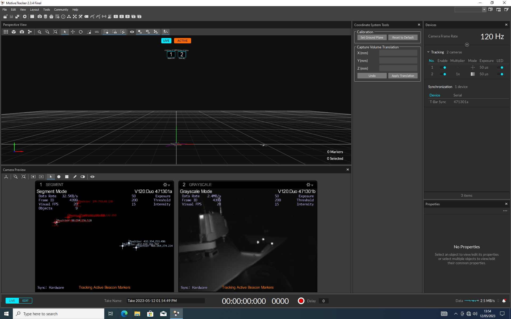
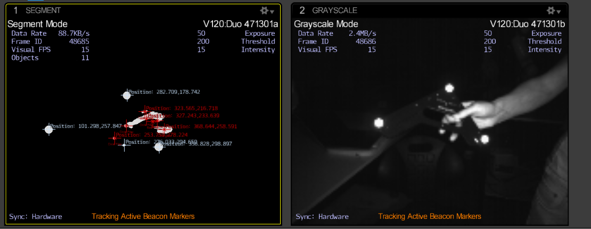
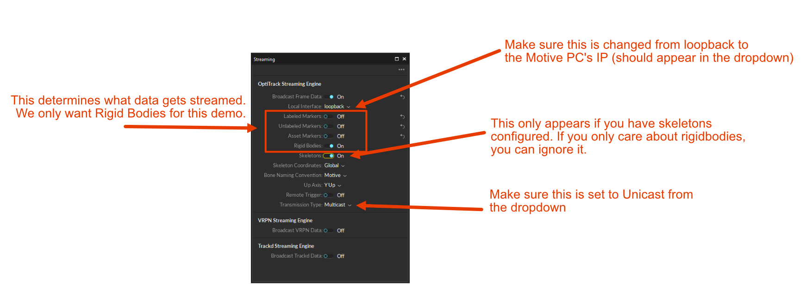

# OptiTrack: Motive 2.3.1 Doom Demo

## Purpose of this demo

This is a minimal demo for the following scenario:
* You are tracking rigidbody or marker data from Motive (OptiTrack's recording software) on one computer (Motive PC)
* You want to process, in real time, that data on a second computer connected on the local network (Personal PC)

In this case, we'll be using a rigidbody to control a DOOM-like game.

## How this all works: The High-Level Picture

Motive supports broadcasting live data over LAN. And so, our solution has three moving pieces:

1. Motive, which broadcasts the coordinates and rotations of rigidbodies from the Motive PC
2. A network client which runs on the Personal PC, receives the data from Motive, and writes into shared memory
3. An end-application, which can read from the shared memory on the Personal PC

This will work for any operating system on the Personal PC-side. This demo requires Python 3.8 or later, and the DOOM-like game requires the `pygame` library (which you can install from the command-line with `pip3 install pygame` (MacOS/Linux) or `pip install pygame` (Windows)).

I tried this out using Motive 2.3.1 and the dual camera system mounted on a tripod.

## Setting up Motive (and Things You Should Know)

### OptiTrack Hardware

You will need:
1. The tripod (in the Hasa canvas bag)
2. The camera (and associated cables, in the long OptiTrack box)
3. The L-shaped calibration marker (in the small OptiTrack box)

To set this up:
1. Set up the tripod (telescope out the legs)
2. Mount the camera on the top of the tripod (you can detach the little cork insert by loosening the clamp, screw it into the base of the camera, and then lock it back on top)
3. Plug the cable hub's built-in cable to the camera. Plug the power cable into hub and connect it to mains. Plug the USB cable into the hub (A-side) and then connect it to the Motive PC.

### Running Motive

1. Sign in to the Motive PC. The username is `controllab` and the password is `cambridge`.
2. Make sure you are connected to the LAN network via an ethernet cable. Use the control panel (or `ipconfig /all` from the command line) to make a note of the Motive PC's IP address.
3. Start Motive 2.3.1 from the desktop.

Once Motive launches, you will be put into the most recent 'layout' used by whoever was last using Motive. It should look similar to the picture below.



NOTE: Charlie has not looked into saving layouts, preconfigurations, etc. We should be careful, when multiple people are collaborating, that we understand how to make sure we can preserve sessions (I suspect this is done through saving and loading layouts)

Verify that there aren't any unexpected rigidbodies already in the scene, and if there are delete them. Note that to select things in Motive, you use 'CTRL+Left Click'

Ensure that both left and right cameras are set to precision mode (from the Camera Preview pane, right click the camera, select video mode, then select precision mode).

At the top of the screen there is a cyan button that says either 'Live' or 'Edit', and an orange button that says either 'Active' or 'Active + Passive' or 'Passive'. These should be set to be 'Live' and 'Passive'. (Note: the passive/active refers to IR markers that are either reflective (passive), which is what we use, or light emitters (active, which we do not use in this demo))

### Calibrating the ground plane

Get out the L-shaped calibration marker. Bring it into the field of view of both cameras:



In the perspective view, you should see small orange dots that correspond to the reflective markers on the L-shaped object. If you can't see these, one of your cameras is either set up to be in grayscale mode (as in the image above), or you are not tracking in passive mode (as in the image above).

Select all of three of these orange dots by CTRL-clicking them. Place the L-shaped object with the corner where you want the origin of your coordinate system to be (i.e. put it flat on a workbench or the floor), then click the 'Set Ground Plane' button in the Calibration panel within Motive.

### Configuring a rigid body

We'll use the L-shaped marker as an example rigid body. Once again, select its three points, and this time right-click and select the option to create a rigid body. If you open up the 'assets' panel from the Layout submenu, you should be able to see it. Wave the L-shaped marker around in space, and verify that Motive is tracking it properly.

In the 'assets' panel, you can rename your rigid body. I named mine 'charlietest'.

### Setting up Motive to stream data over the network

Open the data streaming panel from `Layout > Data Streaming`. It should look like the image below:



Here is what you need to configure:
* Broadcast frame data: ON
* Local interface: Set this from the dropdown menu to be the IP address of the Motive PC (i.e. _not_ localhost)
* Select whichever objects you want to track. In this demo, we'll track rigidbodies only
* Transmission type: Unicast (default is Multicast and you do _not_ want that)

This is all you should need to do within Motive for now. If you run into any problems, the documentation I was using to help me with this is here: [Motive 2.3.1 Getting Started Docs](https://docs.optitrack.com/v/v2.3/quick-start-guides/quick-start-guide-getting-started) and [Data Streaming](https://docs.optitrack.com/v/v2.3/motive/data-streaming).

## Setting up the Personal PC

The code we're using for this is a very quickly hacked-around version of the sample Python client provided by OptiTrack. If you want to get the original code, download NatNetSDK 4.0.0 for Windows (yes, even if you are not using Windows) from [their downloads page](https://optitrack.com/support/downloads/developer-tools.html). You can find the original Python client under `Samples/PythonClient`. My modified code is in this repository under `Client`.

### PythonSample

Let's explain how the PythonSample code under `Client/PythonSample` works:

First, look at what happens on startup (starting from line 167):

```
if __name__ == "__main__":

    optionsDict = {}
    optionsDict["clientAddress"] = "192.168.0.227"
    optionsDict["serverAddress"] = "192.168.0.182"
    optionsDict["use_multicast"] = False

    # This will create a new NatNet client
    optionsDict = my_parse_args(sys.argv, optionsDict)
```

This configures the clientAddress (which should be the IP of the Personal PC), the serverAddress (which should be the IP of the Motive PC), and turns off multicasting. You can hardcode your own values in here, or when you run the client (via `python3 PythonSample.py` on MacOS/Linux or `python PythonSample.py` on Windows) you can pass in those values as arguments. For example, if the Motive PC had IP 192.168.0.123 and the Personal PC had IP 192.168.0.111, you would run:

```
python3 PythonSample.py "192.168.0.123" "192.168.0.111".
```

You can run this now, and it should splurge out a bunch of information into the command-line.

If you type `s` and then press enter, it will send a command to the motive PC to list what the motive PC currently sees. For example, you might get back:

```
-----------------
Message ID  :   5 NAT_MODELDEF
Packet Size : 278
Data Descriptions:

Number of Data Sets: 5
  Dataset   0
  Type: 1 Rigid Body
  data_000 rigid_body_list 0
    Rigid Body Name   : charlietest
    ID                : 1
    Parent ID         : 4294967295
    Position          : [0.00, 0.00, 0.00]
    Number of Markers : 3
      0 Marker Label: 0 Position: [-0.049573 0.000072 -0.065991] 
      1 Marker Label: 0 Position: [0.098971 -0.000039 -0.067292] 
      2 Marker Label: 0 Position: [-0.049398 -0.000034 0.133283] 

  Dataset   1
  Type: 0 Markerset
  data_001 marker_set_list 0
    Marker Set Name: RigidBody
      Marker Count   : 3
          0 Marker Name: Marker1
          1 Marker Name: Marker2
          2 Marker Name: Marker3

  Dataset   2
  Type: 0 Markerset
  data_002 marker_set_list 1
    Marker Set Name: all
      Marker Count   : 3
          0 Marker Name: RigidBody_1
          1 Marker Name: RigidBody_2
          2 Marker Name: RigidBody_3

  Dataset   3
  Type: 5 Camera
  data_003 camera_list 0
    Name        : V120:Duo 471301b
    Position    : [-0.72, 0.47, -0.37]
    Orientation : [-0.10, -0.82, -0.21, 0.52]

  Dataset   4
  Type: 5 Camera
  data_004 camera_list 1
    Name        : V120:Duo 471301a
    Position    : [-0.80, 0.45, -0.19]
    Orientation : [-0.08, -0.77, -0.21, 0.59]


End Packet
-----------------
```

The important part of information for us is that there is a Rigid Body called `charlietest` and it has id `1`.

### How the client handles data

There are two functions you should have a look at:

```
# This is a callback function that gets connected to the NatNet client
# and called once per mocap frame.
def receive_new_frame(data_dict):
    order_list=[ "frameNumber", "markerSetCount", "unlabeledMarkersCount", "rigidBodyCount", "skeletonCount",
                "labeledMarkerCount", "timecode", "timecodeSub", "timestamp", "isRecording", "trackedModelsChanged" ]
    dump_args = False
    if dump_args == True:
        out_string = "    "
        for key in data_dict:
            out_string += key + "="
            if key in data_dict :
                out_string += str(data_dict[key]) + " "
            out_string+="/"
        print(out_string)
```

The first function, above, gets called every time the client receives data from Motive. It contains a ton of data, like timestamps and how many markers are there, etc. In this demo, we don't use any of that data.

The second one, below, is the important one:
```
# This is a callback function that gets connected to the NatNet client. It is called once per rigid body per frame
def receive_rigid_body_frame( new_id, position, rotation ):
    #print( "Received frame for rigid body", new_id," ",position," ",rotation )
    # In this example: rigid body 1 is the only one that exists, and it's the one we care about
    if new_id == 1:
        idx = 0
        for p in position:
            shared_array[idx] = p
            idx += 1

        for r in rotation:
            shared_array[idx] = r
            idx += 1
```

Every time we receive data about a rigid body, this frame gets called. What we're doing here is updating some shared memory, but you could conceivably add any code you want here. Note that we check to make sure the id of the rigid body we're receiving matches the one for charlietest.

## Getting Data into DOOM

As mentioned above, you can write whatever code you want inside of the `receive_rigid_body_frame`. However, to not hang the client process, all I'm doing is writing it into some shared memory. That shared memory is configured in `PythonSample.py` as follows:

```
from multiprocessing import shared_memory
import numpy as np

SHARED_MEM_NAME = "test_sharedmem"

shared_block = shared_memory.SharedMemory(size=7 * 8, name=SHARED_MEM_NAME, create=True)
shared_array = np.ndarray(shape=(7,), dtype=np.float64, buffer=shared_block.buf)
```

This just makes some named shared memory and allows us to write/update a numpy array of length 7 within it (7 elements is enough to store the position (3D) and rotation (represented as a quaternion)).


The DOOM-style-Game is a project I have lifted from this MIT-Licensed project: [https://github.com/StanislavPetrovV/DOOM-style-Game](https://github.com/StanislavPetrovV/DOOM-style-Game).

The only modification I have made is within `player.py`, where I have changed how the controls work. This is accomplished by first opening up the shared memory created by our Motive client:

```
from multiprocessing import shared_memory
import numpy as np

SHARED_MEM_NAME = "test_sharedmem"

shared_block = shared_memory.SharedMemory(size=7 * 8, name=SHARED_MEM_NAME, create=False)
shared_array = np.ndarray(shape=(7,), dtype=np.float64, buffer=shared_block.buf)
```

And then replacing the movement logic from using the keyboard to using the x and y positions of the rigidbody:
```
mocap_x, mocap_y, mocap_z = shared_array[0], shared_array[1], shared_array[2]
        print(f"x={mocap_x}, z={mocap_z}")

        if mocap_x > 0.1:
            num_key_pressed += 1
            dx += speed_cos
            dy += speed_sin
        if mocap_x < -0.1:
            num_key_pressed += 1
            dx += -speed_cos
            dy += -speed_sin
        if mocap_z > 0.1:
            num_key_pressed += 1
            dx += speed_sin
            dy += -speed_cos
        if mocap_z < -0.1:
            num_key_pressed += 1
            dx += -speed_sin
            dy += speed_cos

```

You can run the DOOM game with `python3 main.py` from within the DOOM-style-Game directory (make sure the Motive client is running first so that the shared memory has already been created). 